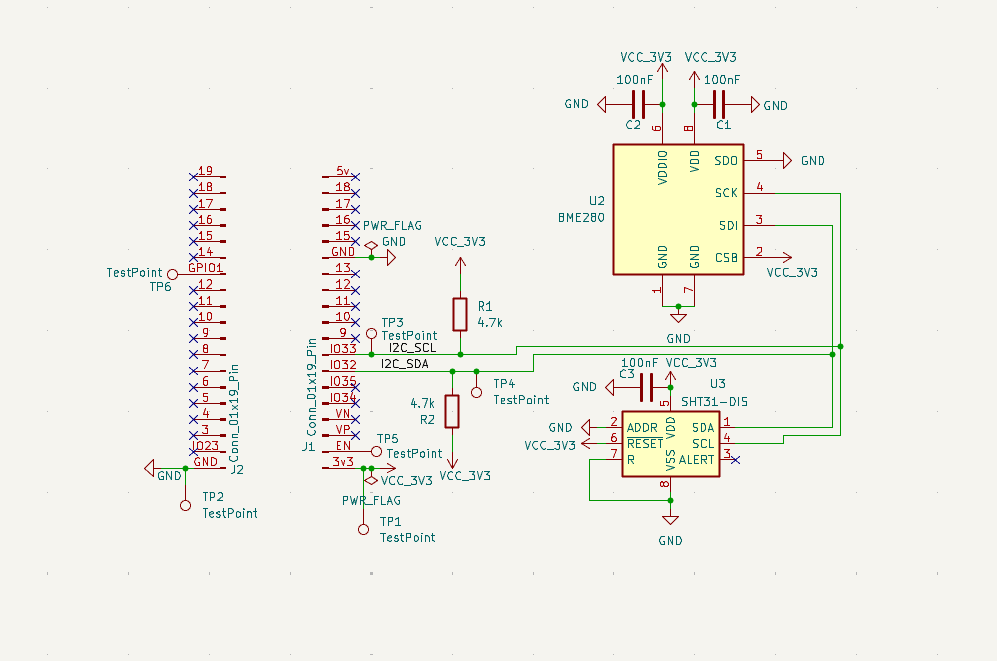

# Voltech Monitoring Node

Wireless environmental monitoring node based on ESP32.  
Dual-sensor I2C architecture: BME280 (temp/humidity/pressure) + SHT31 (temp/humidity).  
Designed for industrial and IoT prototyping applications.

---

## Hardware

| Component | Role |
|-----------|------|
| ESP32-WROOM-32U | Main MCU + WiFi |
| BME280 | Temperature / Humidity / Pressure |
| SHT31-DIS | Temperature / Humidity (redundant) |
| 4.7kΩ x2 | I2C pull-up resistors |
| 100nF x3 | Decoupling capacitors |

---

## Schematic

---

## Stack

- PCB Design: KiCad
- Firmware: ESP32 / C++ (in progress)
- Protocol: I2C → WiFi → MQTT

---

## Status

🟡 In progress — schematic complete, firmware in development

---

*Voltech Studio — Embedded Prototyping | Paris*
